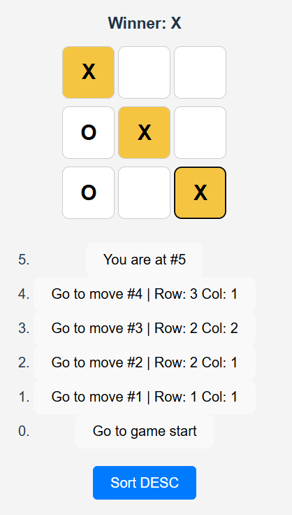

# Tic-Tac-Toe Game

This is a classic Tic-Tac-Toe game built using React, TypeScript, and functional components. The game features a dynamic board, player turns, a win condition, and history navigation.

## Features

- **Classic Tic-Tac-Toe gameplay**: Two players take turns to place their marks (X and O) on a 3x3 grid.
- **Winning condition**: The game checks for a winning combination of three marks in a row, column, or diagonal.
- **Game history**: Keep track of the moves in the game and allow players to jump to any previous move.
- **Sorting of moves**: Ability to toggle the sort order of the history (ascending or descending).
- **Responsive design**: The game adapts to different screen sizes for better usability on mobile devices.

## Technologies Used

- **React**: The core library for building the user interface.
- **TypeScript**: For type safety and better development experience.
- **CSS Flexbox**: For responsive layout and alignment of components.

## Installation

1. Clone the repository:
   ```bash
   git clone https://github.com/VaclavKey/React_TicTacToe.git
2. Navigate to the project directory:
   ```bash
   cd React_TicTacToe
3. Install dependencies:
   ```bash
   npm install
4. Run the app in development mode:
   ```bash
   npm run dev

## Example

Here's what the app looks like when running:


